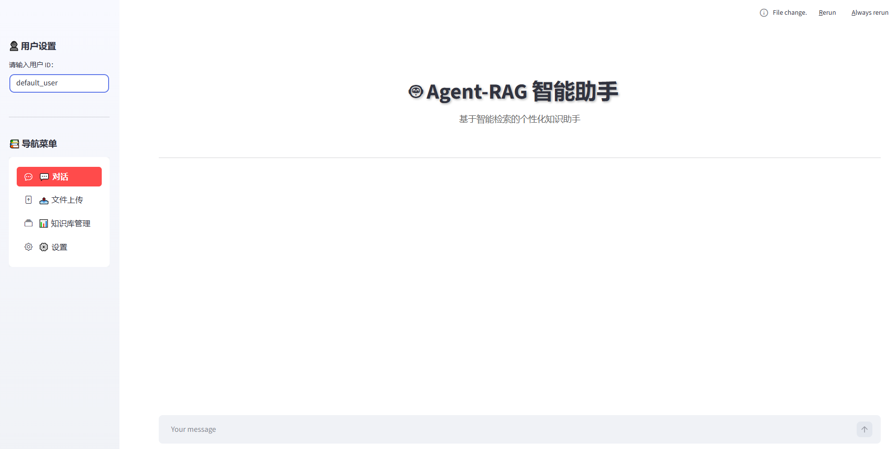

# Agent-RAG 智能问答助手

一个基于 LangChain、ReAct Agent 和检索增强生成(RAG)技术构建的智能对话系统。通过 Streamlit 提供友好的Web界面，支持知识库管理、多轮对话和工具调用。

## 核心功能

- **智能Agent系统**：采用ReAct架构，集成RAG、天气查询、地理位置、数据获取等多种工具，智能选择合适的工具处理用户查询
- **知识库管理**：支持PDF、TXT等多种文档格式上传，使用Chroma向量数据库存储，支持增量更新和文档版本管理
- **多轮对话**：完整的会话历史管理，保留上下文信息，提升对话连贯性
- **可视化界面**：基于Streamlit的现代化Web应用，提供问答、知识库管理、数据分析等多个功能模块
- **中间件系统**：支持工具监控、日志记录、动态提示词切换等功能增强
- **报告生成**：集成数据分析能力，可基于知识库生成定制化报告



## 依赖支持

```
LangChain & LangChain生态：langchain, langchain-core, langchain-chroma, langchain-text-splitters
大模型接口：langchain-community, langchain-openai 等
Web框架：streamlit, streamlit-option-menu
向量数据库：chromadb
文本处理：pypdf, python-docx
配置管理：pyyaml
日志记录：内置logging模块
```

## 快速开始

1. **安装依赖**
   ```bash
   pip install streamlit langchain langchain-chroma langchain-openai pyyaml pypdf
   ```

2. **配置环境**
   - 修改 `config/` 目录下的YAML配置文件（agent.yaml, rag.yaml等）
   - 设置LLM API密钥

3. **运行应用**
   ```bash
   streamlit run app.py
   ```

## 项目结构

- `agent/` - Agent引擎和工具定义
- `rag/` - RAG服务和向量存储
- `utils/` - 工具函数和管理模块
- `config/` - 配置文件
- `data/` - 知识库文档
- `prompts/` - 提示词模板
- `logs/` - 应用日志
